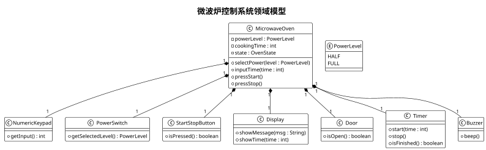
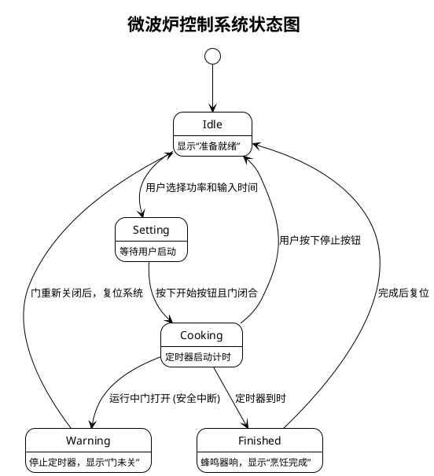

## 1. 领域模型

该领域模型主要反映微波炉控制系统中的关键部件及其关系，主要包括：

- **MicrowaveOven（微波炉）**：系统的核心对象，聚合了控制面板、显示器、门、定时器、蜂鸣器等组件。  
- **PowerSwitch（电源开关）**：用来选择全功率或半功率。  
- **NumericKeypad（数字键盘）**：用于输入烹饪时间。  
- **StartStopButton（启动/停止按钮）**：用于启动或停止烹饪过程。  
- **Display（显示器）**：用于显示当前状态、报警信息和警告信息。  
- **Door（门）**：检测微波炉门的开闭状态，安全要求：门打开时不能启动。  
- **Timer（定时器）**：记录并控制烹饪时间。  
- **Buzzer（蜂鸣器）**：烹饪完成时发出蜂鸣音。  

下面给出一个简单的 UML 类图（领域模型）描述：

**说明：**  
- `MicrowaveOven` 对象负责协调所有组件操作，如选择功率、输入时间、启动烹饪、监控门状态、控制定时器及在烹饪结束后触发蜂鸣器。  
- `PowerLevel` 枚举用于表示半功率和全功率。  
- 显示器用于展示烹饪剩余时间、报警及其它提示信息。

---

## 2. 状态图

针对微波炉控制系统，其状态图示例可以如下描述：

- **初始状态（Idle）**：处于待机状态，显示“准备就绪”；当门关闭且没有启动烹饪时保持该状态。  
- **设置状态（Setting）**：用户选择功率并输入烹饪时间后，系统处于设置状态。  
- **烹饪状态（Cooking）**：用户按下启动后，定时器启动进入烹饪状态，此时若门打开，则必须中断烹饪。  
- **完成状态（Finished）**：当定时器结束时，系统发出蜂鸣声，显示完成信息，并随后返回 Idle 状态。  
- **异常状态**：例如门在烹饪过程中被打开，系统应立刻停止烹饪并报警，可能进入“警告”状态，再回到 Idle 状态。  

下面给出一个基于 PlantUML 的状态图示例：

**说明：**  
- 初始状态为 **Idle**，系统进入待机状态。  
- **Setting** 状态下，用户设置烹饪参数（功率、时间）。  
- 系统在 **Cooking** 状态下正常烹饪；若途中检测到门打开，则跳转到 **Warning** 状态中断烹饪，发出警告，并待门重新关闭后返回待机。  
- 定时器到时进入 **Finished** 状态，触发蜂鸣器，随后回到 **Idle** 状态。
  
以上领域模型和状态图能够较为全面地覆盖微波炉控制系统的主要需求和安全保证要求。