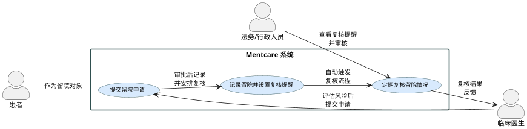

# 用例：精神医疗系统中对高风险患者的强制留院及定期复核

**背景说明：**  
Mentcare 系统为精神类医院和诊所的信息管理系统。在一些情况下，由于患者可能对自己或他人造成伤害（如自杀风险或暴力行为），需要依法律规定对其采取非自愿留院措施，进行必要的强制治疗。该留院决定必须受到严格的法律保障，例如必须定期复核，确保患者不会因无正当理由而被长期限制自由。Mentcare 系统的关键功能之一就是确保这些法律保障得到落实，同时保障患者的权利。

---

## 参与者

- **临床医生/精神科医生**：负责对患者进行评估，并决定是否采取非自愿留院措施。  
- **法务/行政人员**：负责对留院决定进行定期复核，确保符合法律要求。  
- **Mentcare 系统**：用于记录留院信息、自动生成复核提醒并管理患者治疗相关档案。  
- **患者**：接受系统管理的对象（作为记录对象）。

---

## 前提条件

- 患者经过临床评估，被认为存在明显的自我伤害或对他人构成威胁的风险。  
- 留院决定具有足够的医学证明，并且经过初步审批。  
- 系统中已录入相应的病区信息：  
  - 对社会具有危险性的患者安排在高安全级别的设施中；  
  - 对自杀倾向明显的患者安排在适当的监护病房中。

---

## 用例描述

### 主场景

1. **风险评估与留院申请**  
   - 临床医生对患者进行详细的风险评估，确定患者存在对自己或他人造成严重伤害的风险。  
   - 医生在 Mentcare 系统中录入患者信息、评估结果及留院申请，并选择患者所属的留院类别：  
     - 如果患者对社会构成危险，选择“高安全设施”；  
     - 如果患者主要存在自伤风险，选择“密切监护病房”。

2. **留院信息记录与复核提醒**  
   - Mentcare 系统接收留院申请后，记录所有相关信息（如留院时间、原因、患者基本信息等）。  
   - 系统自动生成定期复核的提醒（例如每隔一段固定时间），并通知法务或行政人员进行复核。

3. **定期复核**  
   - 到期后，法务/行政人员收到系统复核通知，登录系统审核患者留院情况和最新评估报告。  
   - 根据复核结果，决定是否继续留院、调整病房或释放患者。所有决定均在系统中保存备案。

4. **患者信息反馈**  
   - 复核决定的结果通过系统反馈给临床医生和相关管理人员，确保后续跟进措施及时有效。

---

### 备选场景

- **二次评估流程**  
  如果初步评估结果不够明确，系统允许医生请求二次评估，并推动多学科合作讨论后再做最终决定。

- **紧急干预流程**  
  在紧急情况下，医生可以利用系统发起紧急留院措施，同时事后在系统中补充详细说明并由法务人员进行后续审查。

- **系统故障备用流程**  
  若 Mentcare 系统暂时不可用，医生可通过预设的手动记录方式提交初步留院申请，并在系统恢复后及时录入数据补齐档案。

---

## 用例交互图

